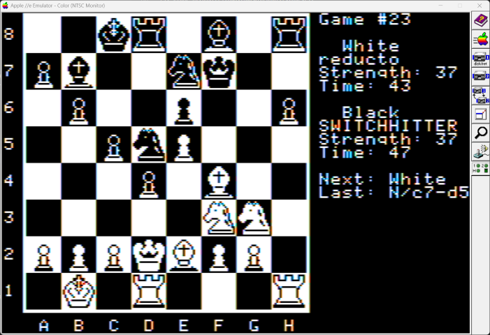
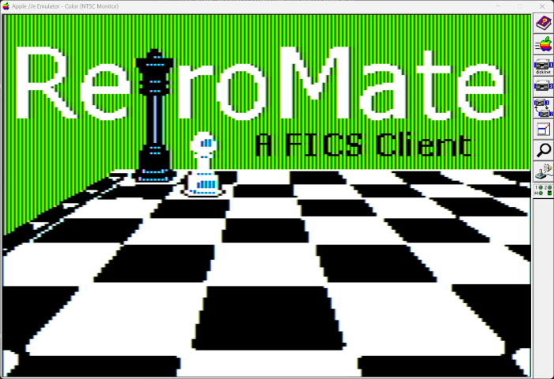
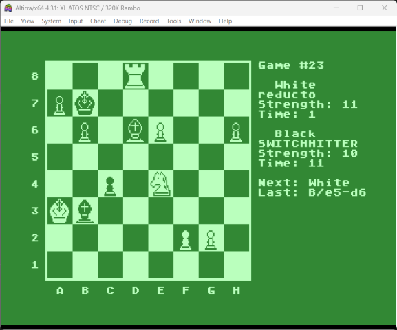
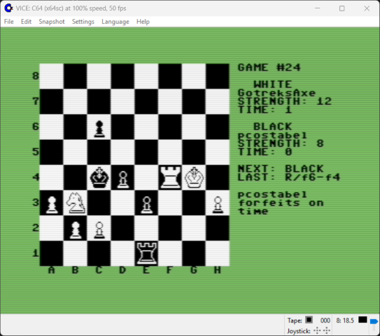
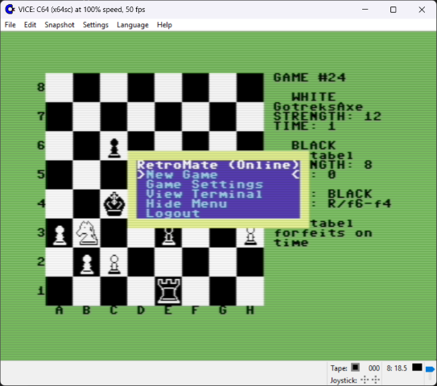
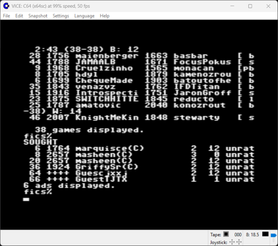
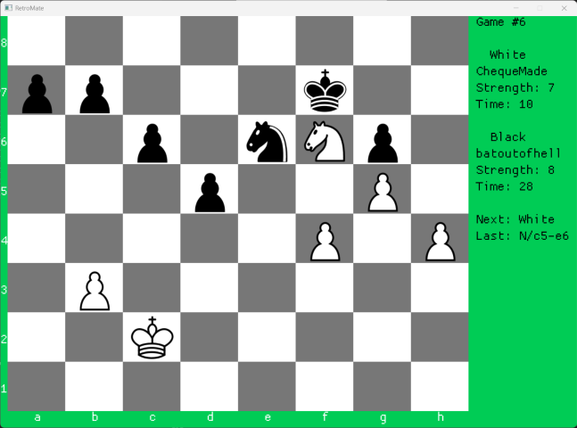

# RetroMate  
A Free Internet Chess Server front-end for modern and retro computers.

## What is FICS, the Free Internet Chess Server?  
FICS is a free chess matchmaking service hosted at `freechess.org:5000` using telnet. Log in using `guest` as the user and type `help` to explore. FICS supports a variety of game modes (standard, blitz, crazyhouse, wild, suicide, etc.). You’ll find several bots to play against, and human players are usually online as well.

## Conception  
RetroMate was originally proposed by Oliver Schmidt. He suggested the idea and offered to provide a framework using IP65 so I could focus on developing the game. Without Oliver, this project would not have happened.

## Platforms  
As of 10 July 2025, RetroMate runs on:
- Apple II  
- Commodore 64  
- Atari XL  
- SDL2-based systems (Windows, Linux, macOS)
[View Screenshots](#screenshots)

## 8-bit Requirements: Hardware / Emulators  
The 8-bit versions use IP65, so you’ll need hardware or an emulator with IP65 support. Recommended emulators:

- Apple II: [AppleWin](https://github.com/AppleWin/AppleWin)  
- Commodore 64: [VICE](https://vice-emu.sourceforge.io/)  
- Atari XL: [Altirra](https://www.virtualdub.org/altirra.html)

## Code & Development  
The Apple II, Atari XL, and C64 versions are built with `cc65` and written mostly in C. The high-resolution drawing code - originally created in 6502 assembly, by Oliver Schmidt, for `cc65-Chess` is reused here.

The SDL2 version is entirely in C and has been compiled using Clang, GCC, and Visual Studio 2022.

## Using RetroMate  

### Offline Menu  
Before connecting:
- Set your FICS account and password (or use a guest account - default).
- Optionally, configure a different server or port.

### Game Setup  
Choose from several game types:
- **Standard, Blitz, Lightning, Untimed**: Classical chess with varying time controls.  
- **Crazyhouse, Suicide, Wild (0–5, 8, 8a, fr)**: Chess variants.

**Settings:**
- **Rated**: Available to registered users. Set to "Yes" to play rated games.  
- **Use Sought**: If "Yes", look for existing opponent requests. If "No", the game sends a new seek request with the following options:  
  - **Start Time**: Minutes on your clock at game start.  
  - **Increment Time**: Seconds added after every move.  
  - **Min/Max Ratings**: Try to find players within this skill range.  

_Default time settings:_
- Standard: 15+0  
- Blitz: 5+2  
- Lightning: 2+2  
- Others: 3+0  

> Note: For Wild 0 and 1, castling must be done in the terminal using `o-o` or `o-o-o`.

### Terminal View  
Use the menu or press `TAB` or `CTRL+T` to switch to the telnet terminal. Here you can use FICS commands directly. Press `ESC`, `TAB`, or `CTRL+T` to return to the game board.

#### Useful Terminal Commands  
- `finger`: View your account info (e.g., GuestXXXX)  
- `match <user>`: Challenge a specific user  
- `games`: List all active games  
- `observe <game#>`: Watch a game in progress  
- `unobserve [game#]`: Stop watching a game  
- `resign`, `abort`: Resign or request abort  
- `say <text>`: Send message to your opponent  
- `sought`: View active seeks  
- `seek [params]`: Advertise a new game request  
- `refresh`, `logout`, `help [subject]`  

RetroMate is stateless - you can, for example, observe multiple games at once (not practical, but supported).

## Chess Board Controls  
- Use arrow keys or WASD to move the cursor  
- `Enter`: Select a piece and confirm move  
- `CTRL+S`: Say something to your opponent  
- `ESC`: Show/hide the menu  
- `TAB` or `CTRL+T`: Toggle to/from terminal

Even when it’s not your turn, you can select a piece to prepare your move - useful for fast games.

**UI indicators:**
- Shows players' names and sides/colors
- "Next" = who moves next  
- "Last" = last move made  
- Status updates (from e.g., say, resign, checkmate) appear below "Last:"

## Mouse Support  
In the SDL2 version:
- Left-click = `Enter`  
- Right-click = `ESC`

## Building RetroMate  
RetroMate uses CMake.  Typically:
```
mkdir build
cd build
cmake .. -G "Unix Makefiles" -DCMAKE_TOOLCHAIN_FILE=$VCPKG_ROOT/scripts/buildsystems/vcpkg.cmake
make  # or ninja/nmake depending on generator
```

### SDL2 Setup (via vcpkg)  
For Linux (including WSL):
```
sudo apt install curl libtool
# I had already installed, in the past, at least: build-essential cmake ninja-build clang
git clone https://github.com/microsoft/vcpkg.git
cd vcpkg && ./bootstrap-vcpkg.sh

# Add these to ~/.bashrc
export VCPKG_ROOT=/your/path/to/vcpkg
export PATH=$PATH:$VCPKG_ROOT

# Install dependencies
vcpkg install sdl2 sdl2-ttf sdl2-image
```

### Build Targets
The build targets are
```
* apple2
* atarixl
* c64
* sdl2
```
Each has a _test target (e.g., `make c64_test`) to run in emulator if detected.

### Emulator/Tool path variables   
Variable | Tool Searched For
--- | ---
VICE_HOME | x64sc x64 & c1541
APPLEWIN_HOME | applewin AppleWin.exe
CP2_HOME      | cp2
ATARI_HOME    | Altirra
DIR2ATR_HOME  | dir2atr
CC1541_HOME | cc1541 (if not using c1541 from Vice)

### Tool download URLs
Disk Image tools | URL
--- | ---
CiderPress-II (cp2) | https://ciderpress2.com/
dir2atr (Atari) | https://www.horus.com/~hias/atari/
c1541 (C64) | Included with VICE distribution
cc1541 (Alternative to 1541) | https://bitbucket.org/ptv_claus/cc1541

### Release History
Release | Title | Date
--- | --- | ---
Beta | Apple 2 | 6 June 2025  
V1.00 | apple2 atarixl c64 sdl2 | 8 July 2025

## Screenshots

### Apple II  



### Atari XL  


### Commodore 64  




### SDL2 (Modern Platforms)  


## Contact
swessels@email.com
